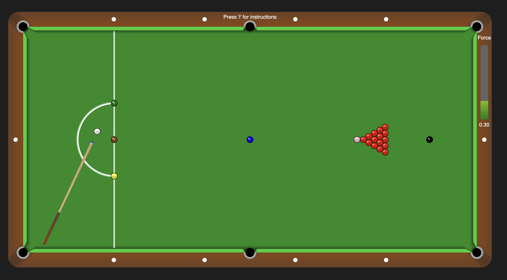

# Snooker Game

[]() []() []() [](LICENSE)

A physics-based snooker simulation with realistic ball dynamics, multiple gameplay modes, and an innovative timed precision challenge mode. Built with p5.js for rendering and Matter.js for rigid-body physics.

## Overview

Snooker Game is an interactive simulation of the classic snooker sport, featuring a fully functional snooker table with pockets, cushions, and physics-accurate ball behavior. Players can aim and strike the cue ball using intuitive mouse and keyboard controls, with support for three standard gameplay modes plus an exclusive dynamic challenge mode (Mode 4).

## Gameplay



## Key Results

| Feature | Details |
|---------|---------|
| **Table** | 1220×610px with realistic dimensions, pockets, and lines |
| **Ball Physics** | Restitution (0.9), friction (0.005), air resistance (0.01) |
| **Cue Control** | Dual input (mouse aiming + keyboard strength) with smooth animation |
| **Game Modes** | 3 standard modes + 1 extension (4 total) |
| **Collision Detection** | Cue-ball collision logging (red, colour, cushion) |
| **Pocketing Logic** | Red removal, colour respotting, multi-ball error detection |
| **Extension** | Mode 4 – Dynamic Precision Snooker (timed, sequenced, obstacles) |

## What's Inside

**Rendering:** p5.js canvas with detailed visual elements (gradient rim, shadow effects, beveled nuts, glow effects on pockets and D zone).

**Physics Engine:** Matter.js rigid-body dynamics with custom cushion bodies, ball restitution, friction, and collision event handling.

**Game Logic:** Four modular state-based gameplay systems—standard modes (1–3) for practice, Mode 4 for challenge gameplay.

**Input System:** Hybrid mouse + keyboard control scheme with real-time cue angle adjustment and strength visualization.

**Extensibility:** Mode 4 introduces timed objectives, power-ups, dynamic pocket changes, and red ball obstacles—a novel gameplay mechanic beyond traditional snooker.

## Quick Start

**1. Open the game:**
```
Open index.html in a modern web browser (Chrome, Firefox, Safari, Edge)
```

**2. Select a game mode:**
```
Press '1' – Fixed ball positions (starting layout)
Press '2' – Random red positions only
Press '3' – Random red + coloured positions
Press '4' – Mode 4 (Dynamic Precision Challenge)
```

**3. Place the cue ball:**
```
Move your mouse inside the D zone (left side, semi-circle)
Click to confirm placement
```

**4. Aim and strike:**
```
Aiming: Move mouse or use Left/Right Arrow Keys
Strength: Scroll mouse wheel or use Up/Down Arrow Keys
Strike: Click mouse or press Spacebar
```

**5. View instructions:**
```
Press 'i' to toggle the instructions overlay at any time
```

## Game Modes

**Mode 1: Standard Fixed**  
Classic snooker setup with balls in starting positions. Red balls form a triangle, coloured balls fixed to their spots.

**Mode 2: Random Reds**  
Red balls spawn randomly across the table; coloured balls remain at fixed positions. Tests adaptability to varied layouts.

**Mode 3: Full Random**  
Both red and coloured balls spawn randomly, avoiding overlaps and invalid areas. Maximum difficulty for standard play.

**Mode 4: Dynamic Precision Snooker (Extension)**  
Timed challenge (180 seconds) requiring potting yellow → green → brown in sequence. Designated pocket changes every 30 seconds. Red balls act as obstacles; hitting one ends the game. Power-ups offer time extensions, red relocation, and unrestricted cue placement.

## Controls

| Action | Mouse | Keyboard |
|--------|-------|----------|
| Aim | Move mouse | ← → Arrow Keys |
| Strength | Scroll wheel | ↑ ↓ Arrow Keys |
| Strike | Click | Spacebar |
| Place cue ball | Click in D zone | — |
| Switch mode | — | 1 / 2 / 3 / 4 |
| Instructions | — | i |

## Tech Stack

- **Rendering:** p5.js (v1.7+)
- **Physics:** Matter.js (v0.19+)
- **Language:** JavaScript (ES6+)
- **Canvas:** HTML5

## Key Features

**Physics Realism:**
- Ball restitution (0.9) and friction (0.005) create natural bouncing and deceleration
- Cushion restitution (0.9) differs from ball restitution for realistic wall collisions
- Air friction (0.01) gradually slows balls to rest

**Cue Mechanics:**
- Two-phase strike animation (pull-back 67% + strike 33%)
- Strength ranges from 0.1 to 0.9, visually represented in a colour-gradient bar
- Pull-back distance scales with strength (0–100 pixels)
- Force magnitude clamped to prevent overshooting

**Visual Polish:**
- Gradient wood rim (#6B4226 → #8B4513)
- Forest green table (#228B22) with white lines
- Shadow layering on cushions for depth
- Glow effects on pockets and D zone
- Beveled metal nut details
- Ball highlights and rotation animation

**Collision Logging:**
- Console output for cue-ball impacts: "Cue-Red", "Cue-Colour: {COLOUR}", "Cue-Cushion"
- Aids debugging and demonstrates collision detection accuracy

**Pocketing System:**
- Red balls: Permanently removed from array and world
- Coloured balls (single): Respotted at fixed default position
- Coloured balls (multiple simultaneous): Error message, all respotted
- Cue ball: Returns to D zone for re-placement

## Assets

The `/Assets/` folder contains screenshot galleries for all game modes:

- **[snooker-mode1.png](Assets/snooker-mode1.png)** – Mode 1: Standard Fixed (classic snooker setup)
- **[snooker-mode2.png](Assets/snooker-mode2.png)** – Mode 2: Random Reds (varied layouts)
- **[snooker-mode3.png](Assets/snooker-mode3.png)** – Mode 3: Full Random (maximum difficulty)
- **[snooker-mode4.png](Assets/snooker-mode4.png)** – Mode 4: Dynamic Precision Snooker (timed challenge)

View all images in the [/Assets folder](Assets/)

## Documentation

Complete project documentation is available in the `/Documentation` folder:

- **Demo Video:** [Snooker Game Full Walkthrough](https://drive.google.com/file/d/128rnCET-iymx92cSFB3T5KOheVKeMNB8/view?usp=sharing) – Comprehensive demonstration of all 4 modes, physics mechanics, collision detection, and Mode 4 extension with console logging.

## Code Architecture

**main.js** – Global constants, table dimensions, ball properties, colour definitions.

**setupAndHelpers.js** – Physics engine initialization, boundary/pocket/ball creation, position validation.

**drawAndRendering.js** – Draw loop, visual rendering, pocketing logic, strength bar, instructions overlay.

**inputAndCollisions.js** – Mouse/keyboard input handling, cue strike animation, collision event logging.

**mode4.js** – Standalone Mode 4 implementation (742 lines) with timer, power-ups, designated pockets, and win/lose conditions.

**Modular Design:** Each module handles a specific concern (setup, rendering, input, physics). Mode 4 is self-contained, enabling easy extension without affecting core gameplay.

## Extension: Mode 4 – Dynamic Precision Snooker

A unique gameplay mechanic combining time pressure, sequenced objectives, and dynamic obstacles:

**Objective:** Pot yellow, then green, then brown before time expires (180 seconds).

**Designated Pocket:** Changes every 30 seconds (random selection from 6 pockets).

**Obstacles:** Red balls act as obstacles; hitting or potting one ends the game immediately.

**Power-ups:** Randomly spawn with three types:
- **Time:** +30 seconds
- **Move Reds:** Relocate all red balls to new positions
- **Place Cue:** Allow unrestricted cue ball placement (bypasses D zone constraint)

**Why It's Unique:** Standard snooker focuses on scoring; Mode 4 emphasizes precision under time and spatial constraints. The dynamic pocket mechanic forces rapid re-strategizing, and power-up events create memorable moments. This mechanic has not been implemented in traditional snooker games.

## Author

**Dhanarasu Naveen**  
Computer Science (AI & Machine Learning Specialisation)  
University of London via SIM Singapore  

## License

MIT License – see [LICENSE](LICENSE) file for details.
